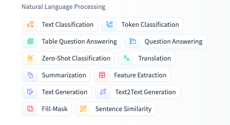

# 基于HF Transformer的NLP实践

## Hugging Face Transformer简介

**Hugging Face Transformers** 是目前最流行的 NLP 模型库之一。它提供了大量预训练的 Transformer 模型（如 BERT、GPT-2、T5 等），支持多种流行深度学习框架（PyTorch 和 TensorFlow），并简化了在各种 NLP 任务上使用这些模型的流程。通过 Transformers 库，开发者可以非常方便地加载**预训练模型**并对文本进行**推理**或者进行**微调**（本教材仅讨论推理）。该库的主要特点包括：

- **模型丰富**：Transformers 库通过 Hugging Face **模型中心** (Model Hub) 提供了上千种预训练模型，涵盖了文本分类、机器翻译、文本生成、问答、命名实体识别等各类任务。用户可以根据任务需要选择合适的现成模型，无需从零训练。
- **统一的API**：库提供了简洁统一的接口，例如 `pipeline` API，使用户可以一行代码完成复杂的 NLP 任务推理。同时还有各种 `AutoModel` 和 `AutoTokenizer` 类，可以根据模型名称自动加载对应的模型和分词器。
- **跨框架与易用性**：Transformers 支持 PyTorch 和 TensorFlow，并有详细的文档和教程。即使没有深厚的深度学习背景，具有基本 Python 编程技能的学生也能通过高级 API 快速上手，在几行代码内实现 NLP 模型的推理。

简而言之，Hugging Face Transformers 库大大降低了使用先进 NLP 模型的门槛，让我们能够以**最低的代码量**完成强大的文本理解和生成任务。在深入实践之前，我们需要了解如何为不同任务选择合适的模型，以及 Transformers 库提供的 pipeline 功能。


## HuggingFace 的模型类型

在使用 Transformers 库进行推理时，选择**合适的预训练模型**非常重要。不同的 NLP 任务需要不同架构或预训练目标的模型。以下是一些模型选择的指导建议：

- **文本分类（如新闻主题分类、垃圾邮件检测）**：选择在**序列分类**任务上预训练或微调的模型，例如 BERT、RoBERTa、DistilBERT 等的**微调版本**。例如，`bert-base-uncased` 在 GLUE 基准上预训练，可用于通用的文本分类任务；还有专门在某些数据集上微调的模型（如在 AG News 新闻数据集上微调的 BERT）。
- **情感分析**：情感分析本质上是二分类或多分类的文本分类任务。可选择在情感数据上微调过的 BERT 系列模型。例如，`distilbert-base-uncased-finetuned-sst-2-english` 是一个在电影评论情感分类(SST-2)数据集上微调的 DistilBERT 模型，适合用于英语正面/负面情感判断。
- **命名实体识别（NER）**：NER 属于**序列标注**（token classification）任务。常用模型是在通用语料上预训练、并在标注数据（如 CoNLL-2003）上微调的 BERT 或其衍生模型。例如，`bert-base-cased` 或 `roberta-base` 在 CoNLL-2003 上微调的版本，可识别人名、地名、组织名等实体。Transformers 提供了一些开箱即用的 NER 模型，如 `dbmdz/bert-large-cased-finetuned-conll03-english` 或更小的 `dslim/bert-base-NER`（DistilBERT 微调NER）。
- **词性标注（POS tagging）**：POS 标注也是序列标注任务，但标签是词性。选择在大型语料上微调的模型，例如在通用英语树库上微调的 BERT 模型。Hugging Face 上有现成模型如 `vblagoje/bert-english-uncased-finetuned-pos`，可以直接用于英文词性标注。
- **文本生成**：文本生成需要**自回归语言模型**，如 GPT-2、GPT-3（通过 API）、GPT-Neo、XLNet 或 T5 等。对于自由文本续写，GPT-2 是常用选择；对于摘要、翻译等**序列到序列**生成任务，T5、BART 等Encoder-Decoder架构更适合。Transformers 提供了 GPT-2 等模型的直接使用，以及像 T5、BART 这种在特定任务上微调的生成模型（如新闻摘要生成等）。
- **其他任务**：如**问答**可以选择 `bert-large-uncased-whole-word-masking-finetuned-squad`（在 SQuAD 上微调的 BERT）；**机器翻译**可选择 Facebook 的 mBART50 或 Helsinki NLP 提供的翻译模型等等。

总的来说，选模型时需要考虑**任务类型**和**模型规模**：若需要速度快、资源有限，考虑蒸馏小模型（DistilBERT、TinyBERT 等）；若追求准确率，可使用大型模型（BERT-large、RoBERTa-large）。在 Hugging Face 模型库网站，可以按照任务过滤模型，并查看每个模型的描述和性能指标，选择最符合需求的模型。本教材后续实践部分将在每个任务中给出具体模型的选择和使用示例。

**HF上NLP任务筛选**




## Transformer 快速入门

以在Google Colab中为例：

### 安装与环境准备

1. 安装transformers

   ```bash
   !pip install transformers
   ```

2. 安装 datasets

   ```python
   !pip install datasets
   ```

3. 安装PyTorch以便使用GPU推理

   ```bash
   !pip install torch
   ```


### 加载模型

#### 使用 “Auto” 系列类自动加载模型

Hugging Face 提供了多种便捷的 “Auto” 类，如 `AutoModel`, `AutoModelForSequenceClassification`, `AutoModelForTokenClassification`, `AutoModelForCausalLM` 等，它们可以根据你指定的模型名称（或本地目录）自动实例化对应的模型。常见用法如下：

```python
from transformers import AutoModel, AutoModelForSequenceClassification

# 1) 通用AutoModel，不带特定任务头
model_name = "bert-base-uncased"
model = AutoModel.from_pretrained(model_name)

# 2) 特定任务，例如文本分类
model_name_cls = "textattack/bert-base-uncased-ag-news"
model_for_classification = AutoModelForSequenceClassification.from_pretrained(model_name_cls)

```

在上例中，`model` 是通用的 BERT 主体，不含分类层等任务头；`model_for_classification` 则是带有序列分类头的 BERT。选择哪个类取决于你想要执行的任务。如果只是想要提取文本特征（embedding）或进一步手动搭建输出层，可以使用 `AutoModel`；如果打算直接做序列分类推理或微调，就使用 `AutoModelForSequenceClassification`。


> #### 从哪里查找模型名称？
>
> 你可以前往 Hugging Face Model Hub 搜索所需模型，例如输入关键字“bert sentiment”找到在情感分析上微调的 BERT 模型。然后复制模型名称（如 `"nlptown/bert-base-multilingual-uncased-sentiment"`）到 `from_pretrained(...)` 中即可。
>
> ### 


### 常见的Pipeline任务

Hugging Face Transformers 提供了高级的 `pipeline` API，封装了常见 NLP 任务的完整处理流程，包括文本预处理、模型推理和输出后处理。通过指定任务名称，`pipeline` 会自动选择默认模型（或你指定的模型）并返回一个**可调用对象**，之后直接传入文本即可获得结果。下面介绍几个常见的 Pipeline 任务及其用法。


|   **任务**   |                          **描述**                          |    **模态**     |                 **Pipeline**                  |
| :----------: | :--------------------------------------------------------: | :-------------: | :-------------------------------------------: |
|   文本分类   |                为给定的文本序列分配一个标签                |       NLP       |      pipeline(task=“sentiment-analysis”)      |
|   文本生成   |                   根据给定的提示生成文本                   |       NLP       |       pipeline(task=“text-generation”)        |
| 命名实体识别 |  为序列里的每个 token 分配一个标签（人, 组织, 地址等等）   |       NLP       |             pipeline(task=“ner”)              |
|   问答系统   |          通过给定的上下文和问题, 在文本中提取答案          |       NLP       |      pipeline(task=“question-answering”)      |
|   掩盖填充   |             预测出正确的在序列中被掩盖的token              |       NLP       |          pipeline(task=“fill-mask”)           |
|   文本摘要   |                  为文本序列或文档生成总结                  |       NLP       |        pipeline(task=“summarization”)         |
|   文本翻译   |              将文本从一种语言翻译为另一种语言              |       NLP       |         pipeline(task=“translation”)          |
|   图像分类   |                     为图像分配一个标签                     | Computer vision |     pipeline(task=“image-classification”)     |
|   图像分割   | 为图像中每个独立的像素分配标签（支持语义、全景和实例分割） | Computer vision |      pipeline(task=“image-segmentation”)      |
|   目标检测   |              预测图像中目标对象的边界框和类别              | Computer vision |       pipeline(task=“object-detection”)       |
|   音频分类   |                   给音频文件分配一个标签                   |      Audio      |     pipeline(task=“audio-classification”)     |
| 自动语音识别 |                将音频文件中的语音提取为文本                |      Audio      | pipeline(task=“automatic-speech-recognition”) |
|   视觉问答   |      给定一个图像和一个问题，正确地回答有关图像的问题      |   Multimodal    |             pipeline(task=“vqa”)              |


> 

### NER识别实例

```python
from transformers import pipeline

# create pipeline for NER
ner = pipeline('ner', aggregation_strategy = 'simple')

ner("Hi, my name is Zhijun Gao. I am from China. I work in Peking University.")
```

> 这会自动下载（若本地无缓存）并加载` dbmdz/bert-large-cased-finetuned-conll03-english` 的序列分类模型以及匹配的 tokenizer，然后完成推理。若不指定 `model` 参数，它会使用默认模型（往往是通用的英语小模型）。对初学者来说，`pipeline` 是非常方便的高层 API，只需关心输入和输出即可。


输出：

```
[{'entity_group': 'PER',
  'score': 0.9911611,
  'word': 'Zhijun Gao',
  'start': 15,
  'end': 25},
 {'entity_group': 'LOC',
  'score': 0.9997775,
  'word': 'China',
  'start': 37,
  'end': 42},
 {'entity_group': 'ORG',
  'score': 0.99745685,
  'word': 'Peking University',
  'start': 54,
  'end': 71}]
```


#### 加载 Tokenizer

**Tokenizer** 的作用是把原始文本拆分为 tokens，再将每个 token 转换成模型可理解的 ID（通常是数字索引）。不同模型使用了不尽相同的分词算法和词汇表，因此通常需要加载 **与模型对应的 tokenizer**。

**使用 AutoTokenizer**

与模型对应的 “Auto” 类类似，Hugging Face 提供了 `AutoTokenizer` 来自动加载正确的分词器。用法很像 `AutoModel`：

```python
from transformers import AutoTokenizer

tokenizer = AutoTokenizer.from_pretrained("bert-base-uncased")

```

这会下载并实例化与 `bert-base-uncased` 模型对应的分词器。如果你使用了其它模型，例如 GPT-2，换成 `"gpt2"` 即可：

```
tokenizer_gpt2 = AutoTokenizer.from_pretrained("gpt2")

```


**手动指定分词参数**

有时我们想对 tokenizer 做一些自定义配置，比如大小写是否保留、特殊符号如何处理等。可以在 `from_pretrained` 中传入额外参数，比如：

```python
tokenizer = AutoTokenizer.from_pretrained(
    "bert-base-uncased",
    do_lower_case=True,    # 是否将所有字母转为小写（大多数英文模型默认为True）
    use_fast=True          # 是否使用快速分词器（Rust实现，通常更快）
)

```


**Tokenizer的基本用法**
实例化 tokenizer 后，可使用 encode, encode_plus, 或 __call__ 等方法对文本进行编码。最常见的是直接调用 tokenizer，将文本字符串转换成模型可输入的格式（包含 input_ids, attention_mask 等）。示例：

```python
text = "Hello, how are you?"
inputs = tokenizer(text, padding=True, truncation=True, return_tensors="pt")
print(inputs)

```

输出可能是一个包含以下字段的字典：

```python
{
  'input_ids': tensor([[ 101, 7592, 1010, 2129, 2024, 2017,  102]]), 
  'attention_mask': tensor([[1, 1, 1, 1, 1, 1, 1]])
}

```

其中 `input_ids` 是分词后对照词表的数字索引，`attention_mask` 指示哪些位置是实际单词（1）以及哪些是填充（0）。如果是 BERT 模型，通常会在开头插入 `[CLS]`（id=101）或 `[UNK]` 等特殊标记，在末尾插入 `[SEP]`（id=102）。不同模型的特殊标记略有不同。

在推理或训练时，将这些张量输入到对应的模型即可。例如：

```
model_outputs = model(**inputs)
```


## 模型与 Tokenizer 版本匹配的重要性

在实践中，一定要确保 **模型与 tokenizer 名称匹配**。如果你加载了某个 GPT-2 模型，却使用了 BERT 的 tokenizer，可能会出现警告或导致结果不正确，因为它们的词表、特殊标记方式完全不同。

在大多数情况下，你可以做以下二选一：

1. **直接使用 pipeline 并指定 `model`**：它会同时下载正确的分词器，自动匹配。
2. **通过相同的名称分别调用 `AutoModelForXxx.from_pretrained(...)` 和 `AutoTokenizer.from_pretrained(...)`**，这样就能保证二者版本对应。


## 动手练习

使用`nlptown/bert-base-multilingual-uncased-sentiment`识别"I absolutely love this new phone!"这句话的情感。


### 练习1：

要求：使用transformer的pipeline 实现

### 练习2：

要求：**不使用 pipeline，而是手动实现情感分析任务**

任务提示：

- 使用 Hugging Face 的 transformers 库手动加载 `nlptown/bert-base-multilingual-uncased-sentiment` 模型和分词器。
- 对输入句子 `"I absolutely love this new phone!"` 进行编码预处理。
- 使用模型进行前向传播，得到 logits。
- 利用 softmax 函数将 logits 转换为概率分布。
- 根据概率分布确定预测的情感标签，并输出该标签及其对应的得分。


## 进一步学习

1. **[Hugging Face 官方文档](https://huggingface.co/docs/transformers)**。这里有最全面的使用示例，包括 `pipeline`、`Trainer`、tokenizer 介绍等。
   
2. **[模型库](https://huggingface.co/models)**。搜索关键词或按照任务、语言过滤找到自己需要的预训练模型。
   
3. **[分词器介绍](https://huggingface.co/docs/transformers/main_classes/tokenizer)**。介绍了“fast tokenizers”的优势以及各种操作细节，适合进阶时深入了解。
   
4. **[pipeline API](https://huggingface.co/docs/transformers/main_classes/pipelines)**。如果你想快速试用或只做推理，这里讲解了最简洁的方式。
   
5. **[GitHub 示例](https://github.com/huggingface/transformers/tree/main/examples)**。展示了如何进行各种任务的微调训练和推理，是了解完整流程的好参考。


