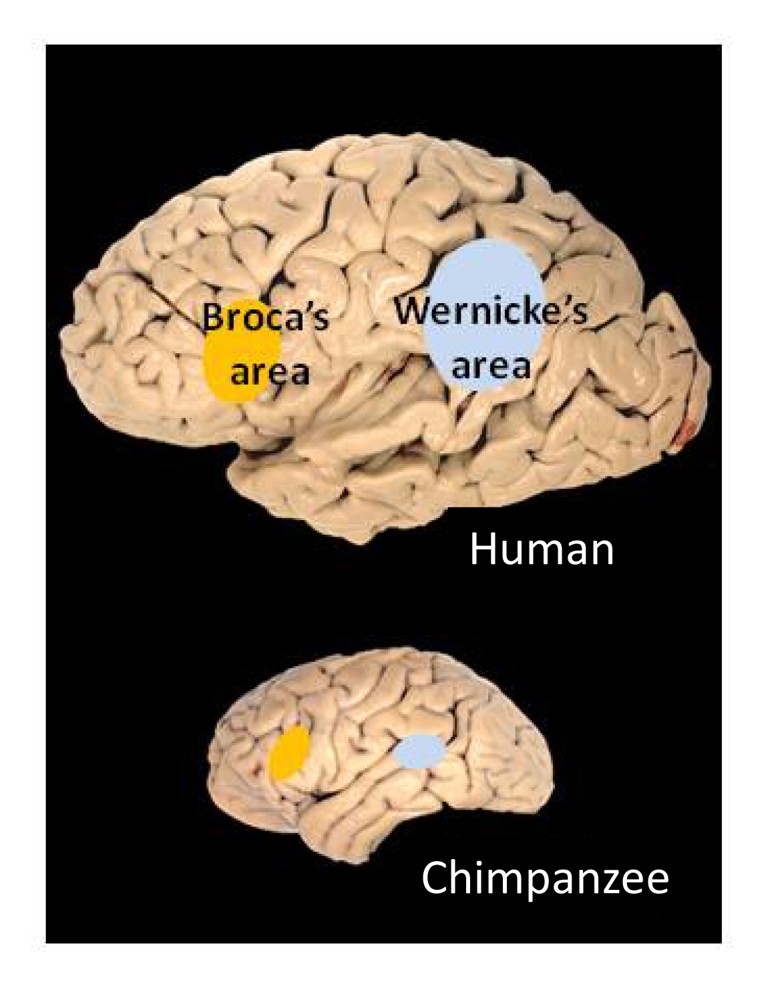

# 应用语言学

## 验真与鉴伪

### 《哈利·波特》的“马甲”小说

 J.K. 罗琳曾以“罗伯特·加尔布雷斯”（Robert Galbraith）的笔名出版侦探小说《布谷鸟的呼唤》。结果有语言学家用“词频—文体分析法”对该小说与罗琳的笔下风格进行比对，推断其作者与《哈利·波特》的作者高度相似。随即罗琳承认了这一事实。出处：[J.K. Rowling’s Secret: A Forensic Linguist Explains How He Figured It Out](https://entertainment.time.com/2013/07/15/j-k-rowlings-secret-a-forensic-linguist-explains-how-he-figured-it-out/)

### 红楼梦前八十回和后四十回

本研究通过对《红楼梦》前八十回与后四十回的关系进行分析，以判断整部作品是否出自同一位作者之手。研究方法采用定量统计与定性分析相结合的方式，比较前、中、后四十回中独有词的使用情况。此外，还利用虚词、实词及词类的N元文法模型，以及实词和词长进行聚类分析，并计算三个部分之间的相似度。

研究结果表明，前八十回与后四十回在用词上存在明显差异。前八十回的用词连贯性较高，更注重细节描写，长词使用较少，使得文本的可读性较强；而后四十回则更偏重动作和场景化描写，长词较多，相对而言可读性稍弱。

> 论文： [《红楼梦》词和N元文法分析](https://manu44.magtech.com.cn/Jwk_infotech_wk3/article/2015/1003-3513/1003-3513-31-4-50.html)

## 从社交媒体语言中发现抑郁或焦虑线索

### 情感词汇与情绪波动
研究发现，抑郁、焦虑等群体在社交媒体发文时，更常使用第一人称代词（如“我”）和负面情感词汇（如“孤单”“焦虑”等）。结合语言学和机器学习的模型，可对大量社交媒体文本进行自动分析，帮助识别存在心理风险的人群，并早期干预。

### 自杀预警系统
有些平台（如 Reddit、微博、推特等）引入 NLP 技术，对带有消极、绝望倾向的关键词进行监测。相关研究团队会在算法识别后，由人工进一步筛查，以便及时向用户提供心理援助信息。

## 语言与健康

语言功能与人类大脑密切相关。大脑中有特定区域专司语言的产生和理解。如果这些区域受损，语言能力会出现障碍，称为**失语症**。研究表明，中风是导致失语症的最常见原因之一；大约34%–38%的中风患者会出现某种失语症。

大脑左半球的**布罗卡区（Broca's area）**和**韦尼克区（Wernicke's area）**是语言产出和理解的重要区域。布罗卡区位于左额叶，负责语言的表达；韦尼克区位于左颞叶，负责语言理解。如果布罗卡区受损，会出现**表达性失语症**（又称Broca失语症）。患者理解他人语言的能力相对完整，但说话非常吃力，往往只能说出零散的内容词，缺乏语法功能词（如介词、冠词），句子听起来像电报文体。尽管句子不连贯，听者通常还能猜出大意，因为患者说出了关键词。然而，患者无法流利地构造完整句子。

与此相对，如果韦尼克区受损，则产生**接受性失语症**（Wernicke失语症）。这类患者能够说话，甚至语调流畅、句法完整，但**语义**内容混乱，往往是自创的或无意义的词串，使人难以理解。他们自己的语言理解能力也受损，可能听不懂别人的话。换言之，韦尼克失语症患者“能说不能懂”，而布罗卡失语症患者“能懂不能说”。这些临床现象表明，语言的不同功能（表达与理解）在大脑中有相对独立的处理模块。

| 对比维度       | 布罗卡区（Broca's Area）         | 韦尼克区（Wernicke's area）     |
|--------------|------------------------------|----------------------------|
| **大脑位置**   | 左额叶                         | 左颞叶                     |
| **负责功能**   | 语言的表达                     | 语言的理解                 |
| **受损后症状** | 表达性失语症（Broca失语症）     | 接受性失语症（Wernicke失语症） |
| **典型表现**   | 能理解语言但无法流利地表达，即“能懂不能说” | 能说但不能理解语言，即“能说不能懂” |
| **语言流畅性** | 无法流利构造完整句子，说话断断续续 | 能流利地说话，但内容杂乱、语义不清 |
| **听者理解难度** | 听者通常能通过关键词猜测大意       | 听者难以理解，因为语言缺乏语义逻辑 |
| **举例说明**   | 说话类似“我……想……苹果”，能懂但不流畅 | 说话类似“太阳书桌走路开心”，语言通畅但无意义 |

上图显示了人类大脑左侧面的语言区位置：黄色标示的是布罗卡区，蓝色标示的是韦尼克区，它们分别主管语言的产生和理解。

## 语言与心理健康

语言还能反映人的心理状态。例如：

- 抑郁症患者的文字和言语往往带有消极情绪词汇、自我代词使用增多等特征；

- 精神分裂症患者的语言可能出现紊乱的句子结构或新造词。

这些都为自动化的文本分析提供了切入点。通过语言技术监测社交媒体帖子中的语言模式，有可能及早识别出抑郁倾向或自杀风险，从而进行干预。

### 案例

在语言与健康的交叉研究中，有一个引人注目的案例：通过分析知名作家晚年作品的语言复杂度变化来推断其认知状态。例如，研究者分析已故英国小说家艾丽丝·默多克（Iris Murdoch）生前不同阶段小说的语言风格，发现她在罹患阿尔茨海默症前后的作品中，词汇丰富度和句法复杂度明显下降。这从侧面印证了疾病对语言能力的影响。尽管一般人不会有多部著作供分析，但这一思路启发了以**日记、书信等个人文本**作为素材进行认知障碍检测的研究。如果一个人的日常书写语料随着年龄增长表现出显著的语言退化特征，或可作为临床筛查的辅助信息。

## 言语治疗（Speech Therapy）

语言不仅承载了人类的思想，也折射出大脑的健康状态。现代技术使我们能够客观分析语言的细微特征，为医疗诊断和康复提供支持。通过语料库分析诊断阿尔茨海默症就是一个典型例子：计算机程序提取患者语言样本中的特征，譬如平均句长、不同词汇比例、语法错误率等，综合判断其与认知障碍人群的相似程度，从而辅助医生做出诊断决策

## 研究机构

1. [Max Planck Institute for Psycholinguistics](https://www.mpi.nl/)
1. [HK PolyU CBS](https://www.polyu.edu.hk/cbs/?sc_lang=en)

