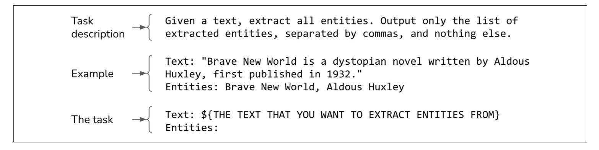

# 提示词导论

**提示词（Prompt）** 是给模型的一条指令，用于执行特定任务。

- 任务可以是**简单的问题回答**，例如：
  - *“谁发明了数字零？”*
- 任务也可以**更复杂**，例如：
  - *让模型研究你的产品创意的竞争对手*
  - *从零开始构建一个网站*
  - *分析你的数据*

提示词的设计直接影响模型的表现，因此优化提示词（Prompt Engineering）是AI工程中的重要环节。

## 提示词示例

提示通常由以下一个或多个部分组成：

- **任务描述**
   你希望模型执行的任务，包括你希望模型扮演的角色以及输出格式。
- **如何完成该任务的示例**
   例如，如果你希望模型检测文本中的毒性，你可以提供一些示例，展示什么是有毒性和无毒性的情况。
- **任务**
   你希望模型执行的具体任务，比如要回答的问题或要总结的书籍。

一个NER(named-entity recognition) 提示词示例

