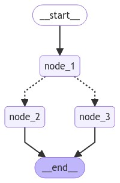

# LangGraph简介


## LangGraph简介

LangGraph 是由 LangChain 开发的一个框架，用于管理集成大型语言模型（LLM）的应用程序的控制流程。

| 框架          | 定义                                                | 核心功能                                                   | 典型场景                                                | 可视化 / 调试                | 集成与扩展                                                   | 安装命令                |
| ------------- | --------------------------------------------------- | ---------------------------------------------------------- | ------------------------------------------------------- | ---------------------------- | ------------------------------------------------------------ | ----------------------- |
| **LangChain** | 面向 LLM 的通用开发框架                             | 链式调用（Chains）、Prompt 管理、Memory、工具调用（Tools） | 快速搭建问答、RAG、插件化 Agent、流水线式文本处理       | 日志输出，第三方插件支持少   | 可与任何 LLM、检索后端、数据库、API 无缝对接                 | `pip install langchain` |
| **LangGraph** | 基于图的执行引擎，用于管理复杂或多 Agent 的控制流程 | 有向图（Nodes/Edges）、状态机、执行图可视化                | 多步骤工作流、条件分支、子 Agent 协作、流程可视化       | 内置执行图渲染、交互式调试   | 可选使用 LangChain 的 LLM/Tool 类；也可独立管理自定义节点逻辑 | `pip install langgraph` |
| **LangSmith** | LangChain Labs 推出的观测与管理平台                 | 调试面板、执行轨迹记录、Prompt & 变量历史、性能指标        | 线上应用监控、Prompt 调优、团队协作、模型和流程性能分析 | 丰富的可视化仪表盘、追踪回溯 | 与 LangChain、LangGraph 深度集成；支持多项目、多环境隔离     | `pip install langsmith` |


**LangGraph 擅长的关键场景包括：**

- 需要对流程进行显式控制的多步骤推理过程
- 需要在各步骤之间保持状态持久化的应用
- 将确定性逻辑与 AI 能力相结合的系统
- 需要人机交互介入的工作流
- 多个组件协同工作的复杂智能体架构

### LangGraph 如何工作？

LangGraph 的核心是使用有向图结构来定义应用的流程：

- **节点（Nodes）** 代表各个处理步骤（例如调用 LLM、使用工具或做出决策）。  
- **边（Edges）** 定义步骤之间可能的转换。  
- **状态（State）** 由用户定义，在执行过程中维护并在节点之间传递。当决定下一个要执行哪个节点时，会参考当前状态。  

### 它与常规 Python 有何不同？为什么需要 LangGraph？

你可能会想：“我完全可以用常规的 Python `if-else` 语句来处理所有这些流程。”

虽然从技术上讲确实可行，但 LangGraph 在构建复杂系统时相较于纯 Python 提供了诸多优势。你可以不用 LangGraph 也能实现同样的功能，但 LangGraph 为你构建了更简便的工具和抽象，包括：

- **状态管理**  
- **可视化**  
- **日志记录（执行轨迹）**  
- **内置人机交互**  
- 以及更多功能。  


## LangGraph的组成部分

在 LangGraph 中，一个应用从入口点（entrypoint）开始，执行过程中，流程会根据情况转向不同的函数，直到到达结束（END）。


| 概念        | 说明                                                         |
| ----------- | ------------------------------------------------------------ |
| **State**       | 用户定义的状态对象，包含执行流程中所需的所有数据，并在各节点间传递，用于决策和控制流程。 |
| **Nodes**       | 有向图中的节点，表示具体的处理步骤或操作（如调用 LLM、执行工具、做出决策等）。       |
| **Edges**       | 有向图中的边，定义节点之间的可能跳转路径及其条件，决定流程的分支和顺序。             |
| **StateGraph**  | 由节点（Nodes）和边（Edges）组成的有向图结构，描述整个应用的执行流程和状态流转。     |

### State

状态是 LangGraph 中的核心概念，它代表了在你的应用程序中流动的所有信息。

```python
from typing_extensions import TypedDict

class State(TypedDict):
    graph_state: str
```


### Node

节点是 Python 函数。每个节点：

- 以当前状态作为输入
- 执行某些操作
- 返回对状态的更新

```python
def node_1(state):
    print("---Node 1---")
    return {"graph_state": state['graph_state'] +" I am"}

def node_2(state):
    print("---Node 2---")
    return {"graph_state": state['graph_state'] +" happy!"}

def node_3(state):
    print("---Node 3---")
    return {"graph_state": state['graph_state'] +" sad!"}
```


例如，节点可以包含：

- LLM 调用：生成文本或做出决策
- 工具调用：与外部系统交互
- 条件逻辑：确定下一步操作
- 人工干预：获取用户输入


> ℹ️ Info
>
> 某些对整个工作流至关重要的节点（如 START 和 END）是由 langGraph 直接提供的。


### Edge

边连接节点，并定义了在图中可能的路径：

```python
import random
from typing import Literal

def decide_mood(state) -> Literal["node_2", "node_3"]:
    
    # Often, we will use state to decide on the next node to visit
    user_input = state['graph_state'] 
    
    # Here, let's just do a 50 / 50 split between nodes 2, 3
    if random.random() < 0.5:

        # 50% of the time, we return Node 2
        return "node_2"
    
    # 50% of the time, we return Node 3
    return "node_3"
```


边可以是：

- 直接：始终从节点 A 到节点 B
- 条件：根据当前状态选择下一个节点


### StateGraph

StateGraph 是承载整个代理工作流的容器：

```python
from IPython.display import Image, display
from langgraph.graph import StateGraph, START, END

# Build graph
builder = StateGraph(State)
builder.add_node("node_1", node_1)
builder.add_node("node_2", node_2)
builder.add_node("node_3", node_3)

# Logic
builder.add_edge(START, "node_1")
builder.add_conditional_edges("node_1", decide_mood)
builder.add_edge("node_2", END)
builder.add_edge("node_3", END)

# Add
graph = builder.compile()
```

可以可视化。




```me

```

