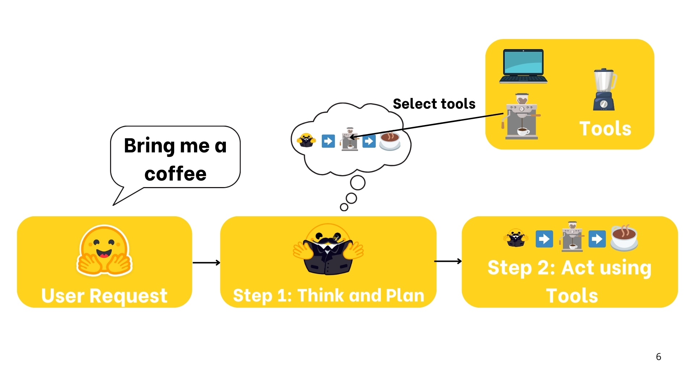

# 智能体概述

## 什么是Agent

### 哲学中的 Agent：行动者的概念

在哲学，尤其是**伦理学、心灵哲学和行动哲学**中：**Agent指的是 **一个有能力做出自主决定并采取行动的存在。

- 它具备：
  - **意图（intention）**
  - **自由意志（free will）**
  - **目的导向（goal-directedness）**
  - **道德责任（moral responsibility）**

在这个意义上，人是“agent”，因为我们会做出基于信念、欲望、目标等的行为决策。

### 咖啡 Agent

假设这个咖啡 Agent收到一个任务：“我需要一杯咖啡。”

Agent开始推理和计划：

1. 去厨房
2. 使用咖啡机
3. 冲调咖啡
4. 端上咖啡

Agent有计划后，他就会执行。为了执行他的计划，他会使用他已知的工具，也就是咖啡机。

> 智能体：一个**能够进行推理、规划和与环境交互的人工智能模型**。




### 正式定义

Agent 是一种系统，它利用 AI 模型与其环境进行交互，以实现用户定义的目标。它将推理、规划和行动执行（通常通过外部工具）相结合，以完成任务。

Agent 有两部分组成：

1. 大脑 (LLM)
2. 身体 （能力与工具）

可执行的动作范围取决于该 Agent 所配备的能力。例如，由于人类没有翅膀，因此无法执行**飞行**动作，但可以执行诸如“行走”、“奔跑”、“跳跃”、“抓取”等动作。

### 智能体光谱

| 代理级别 | 描述                                       | 名称       | 示例模式                                           |
| -------- | ------------------------------------------ | ---------- | -------------------------------------------------- |
| ☆☆☆      | 代理输出不会影响程序流程                   | 简单处理器 | `process_llm_output(llm_response)`                 |
| ★☆☆      | 代理输出决定基本控制流                     | 路由器     | `if llm_decision(): path_a() else: path_b()`       |
| ★★☆      | 代理输出决定函数执行                       | 工具调用器 | `run_function(llm_chosen_tool, llm_chosen_args)`   |
| ★★★      | 代理输出控制迭代和程序继续                 | 多步骤代理 | `while llm_should_continue(): execute_next_step()` |
| ★★★      | 一个代理化工作流可以启动另一个代理化工作流 | 多智能体   | `if llm_trigger(): execute_agent()`                |


### Agent可执行的任务

Agent 可以通过我们实现的工具（Tools）执行任何任务，以完成各种动作（Actions）。工具的设计非常重要，会极大地影响你的 Agent 的质量。某些任务需要专门定制非常具体的工具，而其他任务则可以使用像 “web_search” 这样的通用工具来解决。

> 请注意：**动作（Action）** 与 **工具（Tool）** 并不相同。例如，一个动作可能需要调用多个工具才能完成任务。


工具是提供给 LLM 的一个函数。该函数应完成明确的目标。

| 工具     | 描述                                               |
| -------- | -------------------------------------------------- |
| 网络搜索 | 允许代理从互联网获取最新信息。                     |
| 图像生成 | 根据文本描述创建图像。                             |
| 检索     | 从外部来源检索信息。                               |
| API 接口 | 与外部 API（如 GitHub、YouTube、Spotify 等）交互。 |


总而言之，Agent 是一个以 AI 模型（通常是大型语言模型）为核心推理引擎的系统，能够：

- **理解自然语言**：以有意义的方式解释并响应人类指令。  
- **推理与规划**：分析信息、做出决策并制定解决问题的策略。  
- **与环境交互**：收集信息、执行操作并观察这些操作的结果。  


## “思考–行动–观察”循环

### 核心组件

智能体在一个持续循环中工作：思考（Thought）→ 行动（Action）→ 观察（Observation）。

让我们一起分解这些步骤：

- **思考（Thought）**：Agent 的 LLM 部分决定下一步应该做什么。  
- **行动（Action）**：Agent 调用工具并传入相关参数来执行操作。  
- **观察（Observation）**：模型反思工具返回的响应。  

### 天气Agent

#### Thought

**内心想法：**

“用户需要获取纽约的当前天气信息。我有一个可以获取天气数据的工具。首先，我需要调用天气 API 来获取最新的详细信息。”


#### Action

**工具使用：**

基于其推理以及 已知 `get_weather` 工具的事实，Agent 准备了一个 JSON 格式的命令来调用天气 API 工具。例如，它的第一个动作可能是：

Thought：我需要检查纽约的当前天气。

```json
   {
     "action": "get_weather",
     "action_input": {
       "location": "New York"
     }
   }
```

在这里，动作明确指定了要调用的工具（例如：get_weather）以及要传递的参数（“location”: “New York”）。

#### 观察

**来自环境的反馈：**

工具调用后，Agent 会收到一条观察结果。可能是来自 API 的原始天气数据，例如：

“当前纽约天气：局部多云，15°C，相对湿度60%。”

该观察结果随后被添加到提示中，作为额外的上下文。它充当现实世界的反馈，确认动作是否成功并提供所需的详细信息。


#### 更新的思考

反思：

有了观察结果，Agent 更新了它的内部推理：

“现在我已经获得了纽约的天气数据，就可以为用户整理回答了。”


#### 最终动作

Agent 生成最终响应，按照我们告诉它的格式：

Thought：我现在已经有了天气数据。当前纽约的天气是局部多云，气温15°C，相对湿度60%。

最终回答：当前纽约的天气是局部多云，气温15°C，相对湿度60%。

此最终动作将答案发送回用户，完成整个循环。


### 小结

我们在这个示例中看到：

**智能体不断循环直到目标完成：**
 Agent 的过程是循环的。它从一次思考开始，然后通过调用工具来执行动作，最后观察结果。如果观察显示有错误或数据不完整，Agent 可以重新进入循环以修正方法。

**工具集成：**
 调用工具（如天气 API）的能力使 Alfred 能够超越静态知识，检索实时数据，这是许多 AI 智能体的关键特性。

**动态适应：**
 每个循环都允许智能体将新信息（观察结果）纳入其推理（思考）中，确保最终回答信息充分且准确。

这个示例展示了 ReAct 循环背后的核心概念（我们将在下一节中详细讨论）：思考、行动和观察的相互作用，使 AI 智能体能够迭代地解决复杂任务。

通过理解并应用这些原则，你可以设计出不仅能推理其任务，还能有效利用外部工具完成任务，并根据环境反馈不断完善输出的智能体。


## 思考：内部推理与 ReAct 方法

在本节中，我们将深入探讨 AI 智能体的内部机制——它的推理与规划能力。我们会研究智能体如何利用其内部对话来分析信息，将复杂问题分解为可管理的步骤，并决定下一步要采取的行动。此外，我们还将介绍 ReAct 方法，这是一种提示技术，鼓励模型在执行操作前“逐步思考”。

思考代表智能体为完成任务而进行的内部推理与规划过程。

这利用了智能体的大型语言模型（LLM）在提示中呈现信息时的分析能力。

可以将其视为智能体的内部对话，在其中它考虑当前任务并制定策略。

智能体的思考负责访问当前的观察结果，并决定下一步的行动。

通过这一过程，智能体可以将复杂问题分解为更小、更易管理的步骤，反思过去的经验，并根据新信息不断调整其计划。

以下是一些常见思考示例：

| 思考类型   | 示例                                                         |
| ---------- | ------------------------------------------------------------ |
| 规划       | “我需要将此任务分解为三步：1）收集数据；2）分析趋势；3）生成报告” |
| 分析       | “根据错误信息，问题似乎出在数据库连接参数上”                 |
| 决策       | “考虑到用户的预算限制，我应该推荐中端方案”                   |
| 问题解决   | “为了优化这段代码，我应首先进行性能分析以识别瓶颈”           |
| 记忆整合   | “用户之前提到他们更喜欢 Python，所以我将提供 Python 示例”    |
| 自我反思   | “我上次的方法效果不佳，我应该尝试不同的策略”                 |
| 目标设定   | “要完成此任务，我需要首先确定验收标准”                       |
| 优先级排序 | “应在添加新功能之前先解决安全漏洞”                           |


> 注意：对于经过微调以支持函数调用的 LLM，思考过程是可选的。如果你不熟悉函数调用，将在“行动”部分提供更多细节。


### ReAct 方法

一个关键方法是 ReAct 方法，即将“推理”（Reasoning，Think）与“行动”（Acting，Act）结合。

- ReAct 是一种简单的提示技术，在让 LLM 解码下一个 token 之前，附加“让我们一步步思考”（Let’s think step by step）。
- 通过提示模型“逐步思考”，解码过程更倾向于生成一个计划，而不是直接给出最终解决方案，因为模型被鼓励将问题分解为子任务。
- 这使模型能够更详细地考虑各个子步骤，通常比尝试直接生成最终解决方案时更少出错。  


## 行动：使智能体与其环境交互

在本节中，我们探讨 AI 智能体与其环境交互所采取的具体步骤。  
我们将介绍如何表示操作（使用 JSON 或代码）、停止与解析方法的重要性，并介绍不同类型的智能体。  
操作是 AI 智能体与其环境交互时所采取的具体步骤。

无论是浏览网页获取信息，还是控制物理设备，每个操作都是智能体执行的有意图的动作。

例如，协助客户服务的智能体可能会检索客户数据、提供支持文档或将问题转交给人工客服代表。

### 智能体行动类型

不同类型的智能体以不同方式执行操作：

| 智能体类型                                   | 描述                                                        |
| -------------------------------------------- | ----------------------------------------------------------- |
| **JSON 智能体**                              | 操作以 JSON 格式指定。                                      |
| **代码智能体**                               | 智能体编写一段代码块，由外部解释执行。                      |
| **函数调用智能体（Function-calling Agent）** | JSON 智能体的一个子类别，经过微调以为每个操作生成新的消息。 |

### 行动的用途

操作本身可用于多种目的：

| 操作类型     | 描述                                   |
| ------------ | -------------------------------------- |
| **信息收集** | 执行网络搜索、查询数据库或检索文档。   |
| **工具使用** | 发起 API 调用、运行计算或执行代码。    |
| **环境交互** | 操作数字界面或控制物理设备。           |
| **通信**     | 通过聊天与用户互动或与其他智能体协作。 |

智能体的一个关键能力是在操作完成时**停止生成新 token**，这一点对于所有格式的智能体（JSON、代码或函数调用）都适用。  这可以防止意外输出，确保响应清晰准确。

LLM 仅处理文本，并使用文本来描述它要执行的操作以及要传递给工具的参数。  

### 停止与解析 方法

实现操作的关键方法之一是“停止与解析”方法。此方法可确保智能体的输出具有结构化且可预测的特点：

1. 结构化格式生成。智能体以清晰的、预先定义的格式（JSON 或代码）输出其预期执行的操作。
2. 停止进一步生成。一旦操作完成，智能体停止生成额外的 token，防止产生多余或错误的输出。
3. 解析输出 。外部解析器读取格式化后的操作，确定要调用的工具，并提取所需的参数。

例如，需要检查天气的智能体可能会输出：
```
Thought: 我需要检查纽约的当前天气。
Action :
{
  "action": "get_weather",
  "action_input": {"location": "New York"}
}
```


框架随后可以轻松解析要调用的函数名称及其参数。这种清晰的机器可读格式将错误降至最低，并使外部工具能够准确地处理智能体的命令。

> [!NOTE]
>
> 注意：函数调用型智能体以类似方式工作，通过结构化每个动作来调用指定函数并传入正确的参数。我们将在后续单元中深入探讨这类智能体。


## 观察：整合反馈以反思和适应

观察是智能体感知其行动后果的方式。  它们提供了推动智能体思考过程并指导后续行动的关键信息。  它们是来自环境的信号——无论是 API 返回的数据、错误信息还是系统日志——都指导下一轮思考。  

在观察阶段，智能体会：  
- **收集反馈**：接收数据或确认其行动是否成功（或失败）。  
- **附加结果**：将新信息整合到现有上下文中，有效更新其记忆。  
- **调整策略**：利用更新后的上下文来完善后续的思考和行动。  

例如，如果天气 API 返回“局部多云，15°C，60% 湿度”，该观察结果会被附加到智能体的记忆中（提示末尾）。  

智能体随后会根据该信息决定是否需要额外数据，或是否已准备好提供最终回答。  

这种反馈的迭代整合确保智能体始终与其目标保持动态一致，不断根据现实世界的结果学习和调整。  

这些观察可以采取多种形式，从读取网页文本到监控机器人手臂的位置。这类似于工具“日志”，为操作执行提供文本反馈。  

| 观察类型       | 示例                               |
| -------------- | ---------------------------------- |
| 系统反馈       | 错误信息、成功通知、状态码         |
| 数据变化       | 数据库更新、文件系统修改、状态改变 |
| 环境数据       | 传感器读数、系统指标、资源使用情况 |
| 响应分析       | API 响应、查询结果、计算输出       |
| 基于时间的事件 | 达到截止日期、计划任务完成         |

### 观察结果如何附加？

执行操作后，框架按以下顺序进行：  
1. 解析操作以确定要调用的函数及其参数。  
2. 执行该操作。  
3. 将结果作为“观察”附加。  


## 开源项目

- [OWL](https://github.com/camel-ai/owl/blob/main/README_zh.md) （ GAIA 基准测试中取得 58.18 平均分，在开源框架中排名，排名第一）
- [OpenManus](https://github.com/mannaandpoem/OpenManus)


常见的Agent框架

- [smolagents](https://huggingface.co/docs/smolagents/en/index)
- [LlamaIndex](https://www.llamaindex.ai/)
-  [LangGraph](https://langchain-ai.github.io/langgraph/)


智能体基准测试

https://www.gaianet.ai/agents
