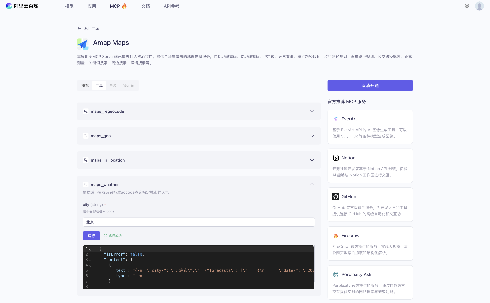

# 模型上下文协议 MCP

模型上下文协议 (MCP)[^1]是一个开放协议，用于标准化应用程序向大语言模型提供上下文的方式。可以将 MCP 想象成 AI 应用程序的 USB-C 接口。就像 USB-C 为设备连接各种外设和配件提供了标准化方式一样，MCP 为 AI 模型连接不同的数据源和工具提供了标准化方式。

MCP 最先由 Anthropic 提出，是一个开源、标准的协议。MCP 的详细介绍和具体实现，请参考 [MCP 官网](https://modelcontextprotocol.io/)。

## MCP的作用

在使用LLM构建Agent时，通常需要与各种工具和数据机场，MCP为此提供了很大的便利：

1. LLM可直接加入MCP服务，可以预见MCP服务会不断增长
2. 避免供应商锁定，可以自由切换LLM
3. 保护的你的数据隐私

### 高德地图MCP示例

高德地图MCP Server现已覆盖12大核心接口，提供全场景覆盖的地理信息服务，包括地理编码、逆地理编码、IP定位、天气查询、骑行路径规划、步行路径规划、驾车路径规划、公交路径规划、距离测量、关键词搜索、周边搜索、详情搜索等。

可以在千问、Claude等LLM中使用高德地图提供的数据。下方是查询北京市天气的示例。

### MCP 服务器

- [阿里百炼 MCP广场](https://bailian.console.aliyun.com/?spm=a2c4g.11186623.0.0.406f4eb1wXV5a9&tab=mcp#/mcp-market)

### 核心 MCP 概念

MCP 服务器可以提供三种主要能力：

- **资源**：类似文件的数据，客户端可以读取（例如 API 响应或文件内容）
- **工具**：可由 LLM 调用的函数（需经用户批准）
- **提示**：预先编写的模板，帮助用户完成特定任务

### MCP的核心功能

- Resources 资源
- Prompts 提示词
- Tools 工具
- Sampling 采样
- Roots 根目录
- Transports 传输层

其中 MCP 的传输层支持了 2 种协议的实现：stdio（标准输入/输出）和 SSE（服务器发送事件）

## 参考

[^1]: https://docs.anthropic.com/zh-CN/docs/agents-and-tools/mcp	
