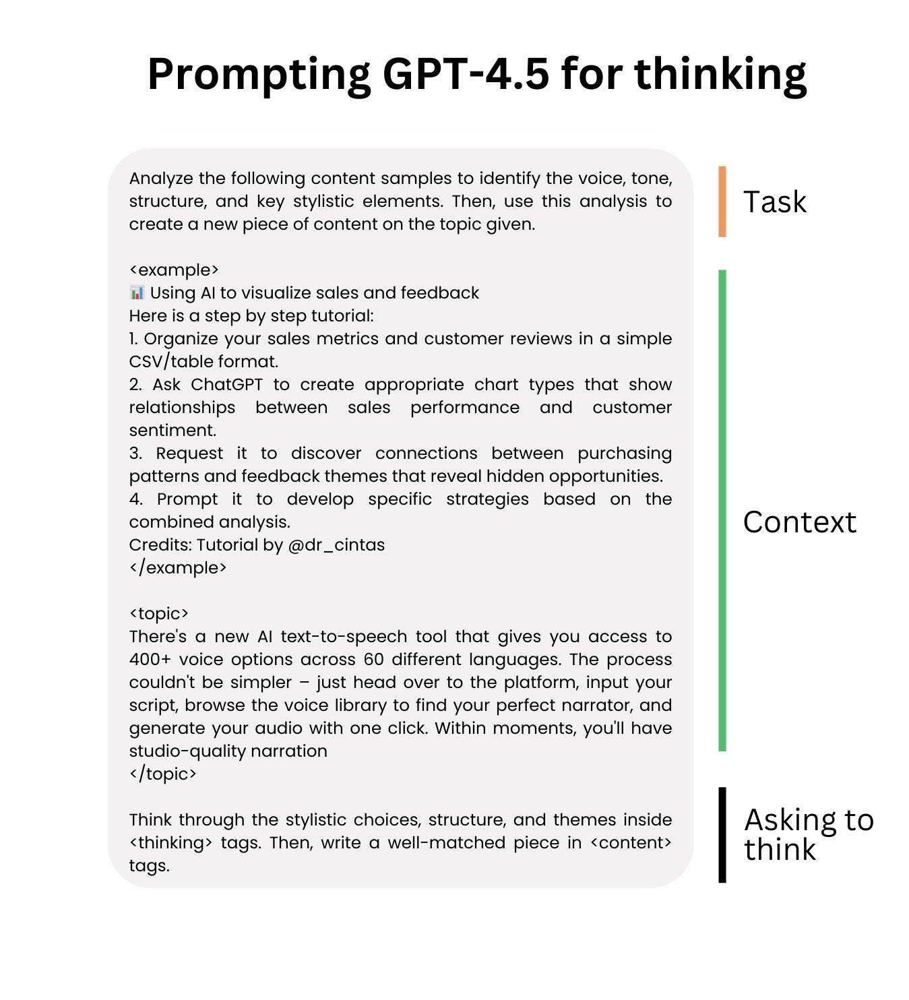
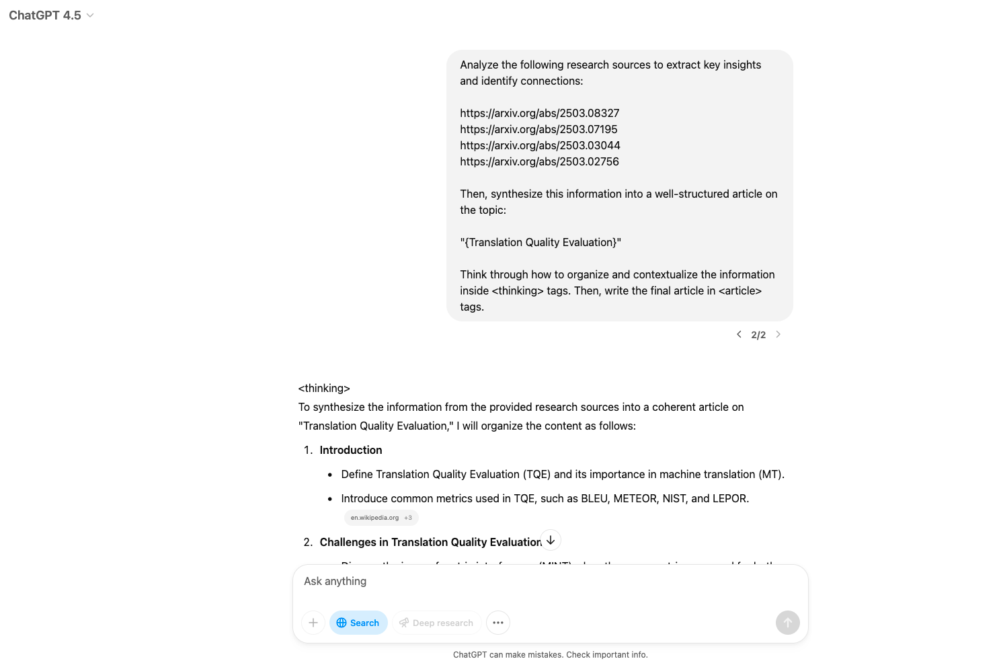

# 提示词

## Prompt框架

### Google 框架

适合复杂任务的处理，帮助用户逐步推理、系统地拆解任务，以获得准确的输出

明确意图：确保你清楚地表达任务的核心目标，传达最重要的信息
提供上下文：提供必要的背景信息和任务相关的背景说明
限制输出范围：给模型设定边界，确保生成的内容和指令紧密相关
分解任务：将复杂的任务拆解成多个小任务，使其更易执行
逐步思考：对于复杂的任务，引导模型按步骤执行，逐步进行推理


### LangGPT 框架

适用于系统化任务的设计，框架通过模板化和变量的引入，任务编写更加灵活、清晰

1. 角色定义：明确指定模型在任务中的角色和责任
2. 任务描述：简洁明确地描述任务内容，避免冗长
3. 变量应用：根据需要灵活使用变量，可调整的参数使任务更具适应性
4. 步骤划分：将任务分解为具体、清晰的步骤，使操作有条不紊
5. 工具与格式要求：明确执行任务时需要的工具、格式等


### TAG 提示词框架

简洁明了，适合任务明确、步骤简单的场景 通过快速识别任务、行动和目标，使任务执行更加高效

1. 任务：明确描述需要完成的任务内容
2. 行动：详细说明完成任务的具体步骤或方法
3. 目标：说明任务完成后的期望效果或最终目标


### COAST 提示词框架

适用于需要多维度考虑的任务，特别是在网络安全领域，需要结合背景、目标、行动、支持和技术来全面考虑任务的执行

1. 背景：提供任务相关的背景信息
2. 目标：明确说明任务的最终目标或期望成果
3. 行动：描述执行任务的具体步骤或方法
4. 支持：提供额外的资源或帮助，辅助完成任务
5. 技术：说明完成任务所需的技术或工具

 ### APE 提示词框架

适合定义清晰任务和期望结果的场景，帮助快速明确任务执行的目的和目标，适用于对结果有高要求的任务

1. 行动：明确执行的具体任务或活动
2. 目的：解释执行该任务的意图和目标
3. 期望：明确预期的成果或目标


## GPT4.5的提示策略

### 让GPT4.5思考

可以使用类似 `<thinking>` 和 `<answer>` 这样的XML标签，将它的推理过程与最终答案分隔开，从而改善它的回答效果。



### 文献综述提示词

```md
Analyze the following research sources to extract key insights and identify connections: 

"{RESEARCH_SOURCES}" 

Then, synthesize this information into a well-structured article on the topic: 

"{ARTICLE_TOPIC}" 

Think through how to organize and contextualize the information inside <thinking> tags. Then, write the final article in <article> tags.
```


输出：

