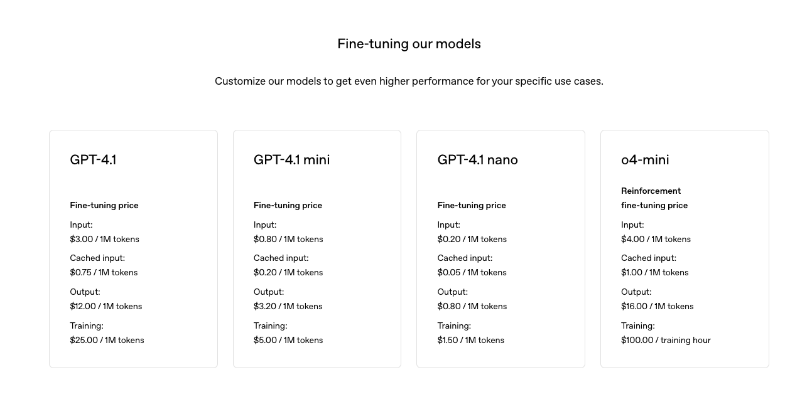
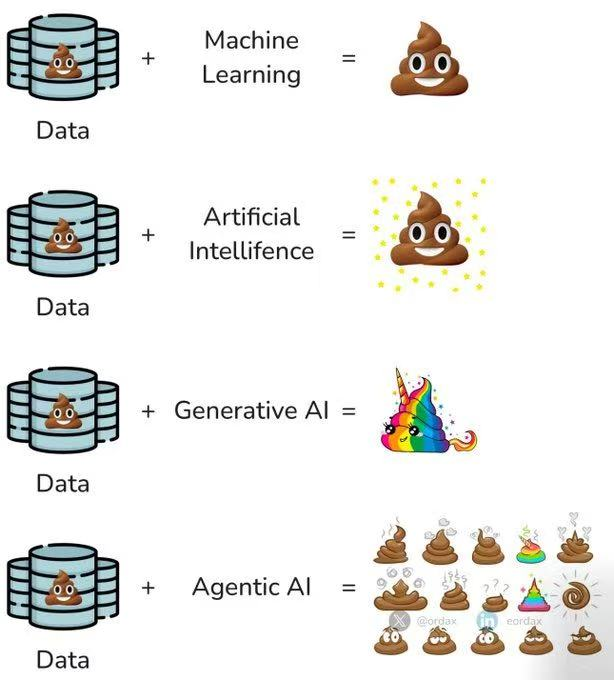
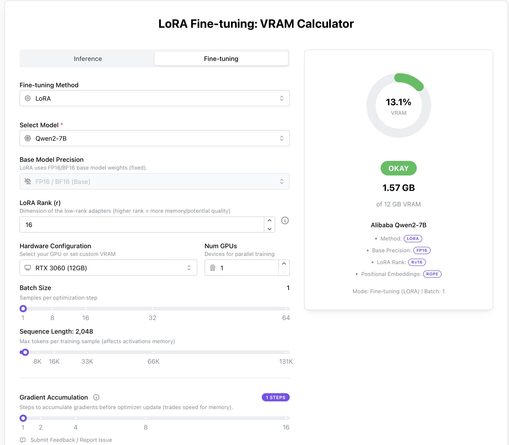
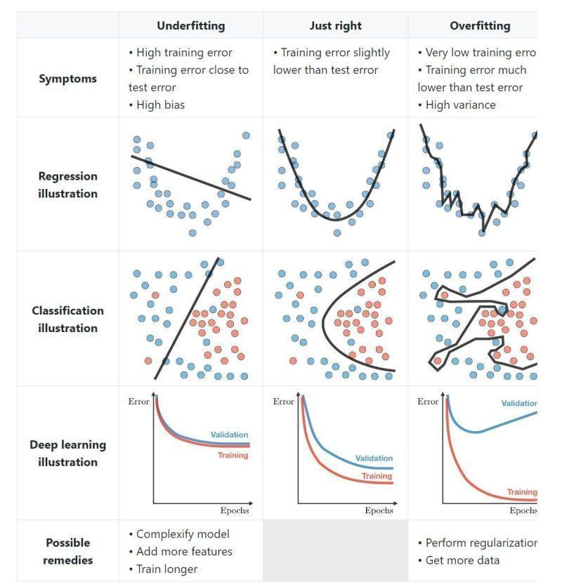

# 微调基础

## 什么是微调

关于微调的范围尚未形成共识，有的专家学者认为，微调（Fine Tuning）”指的是**有监督微调**，而非持续预训练或通过人类反馈进行的强化学习（RLHF），也有学者认为都包括。

微调让你能够定制预训练模型，使其在特定任务上表现卓越。将微调与提示词工程结合使用，相较于单纯提示，还可带来以下几项额外优势：

- 可以提供比单次请求的上下文窗口所能容纳的更多示例输入和输出，从而让模型处理更丰富多样的提示。
- 可以使用更短的提示，包含更少的示例和上下文数据，在大规模使用时节省 token 成本，并降低延迟。
- 可以使用专有或敏感数据进行训练，而无需在每次请求中都以示例形式包含这些数据。
- 你可以训练一个更小、更便宜、更快速的模型，以在大型模型成本不具优势的特定任务上取得优秀表现。


### 常见微调方法

| 方法                    | 工作原理                                                     | 用例                                                         |
| ----------------------- | ------------------------------------------------------------ | ------------------------------------------------------------ |
| **监督式微调（SFT）**   | 提供正确响应示例以指导模型行为，通常使用人工生成的“真实答案”来展示模型应如何响应。 | - 分类<br />- 细微翻译<br />- 生成特定格式内容<br />- 修正复杂提示下的指令执行失败 |
| **直接偏好优化（DPO）** | 对同一提示同时提供正确和错误响应示例，通过标识正确响应改进模型在主观输出上的表现。 | - 文本摘要，聚焦关键信息<br />- 生成具有合适语气和风格的聊天信息 |
| **强化微调（RFT）**     | 仅适用于推理模型：生成响应后由专家评分，并使用得分强化模型的思维链，以提升更高得分的响应。该方法在专家对理想输出达成一致时有效。 | - 需要高级推理的复杂领域任务<br />- 基于病史和诊断指南的医学诊断<br />- 从法律判例法中确定相关段落 |

```{image} images/fine-tuning-cycle.png
:width: 50%
:alt: 流程图
```

## 微调之前

虽然”预训练+微调“已经是一个新的范式，但微调并非能解决一切问题。微调是一项高级功能，而不是你生成式 AI 旅程的起点。你应当已经熟悉使用大型语言模型（LLMs）的基础知识。首先，应通过提示词工程（Prompt Engineering）和/或检索增强生成（RAG）来评估基础模型的表现，从而获取性能基线。

在没有微调的情况下获得性能基线，对判断微调是否真正提升模型性能至关重要。使用劣质数据进行微调只会让基础模型更糟，但若无基线，就难以发现性能回退。

### 适合微调的场景

- 引导模型以特定且定制化的风格、语气或格式输出内容。
- 当需要用来引导模型的信息过长或过于复杂，无法全部放入提示窗口。

### 尚未准备好进行微调的情形

- 没有明确的微调用例，或只能给出“我想让模型更好”之类的模糊理由。
- 如果你主要目的是“降低成本”作为主要动机，需要谨慎。微调在某些场景中确实可以通过缩短提示或使用更小的模型来降低成本，但训练本身的前期投入更高，而且你还需要为托管自定义模型支付费用。OpenAI GPT-4.1的微调费用，以及微调后调用的收费情况如下。

	

- 如果想为模型添加域外知识，建议先使用“检索增强生成”（RAG）方案，根据用例和数据的不同，这通常是一种更便宜、更灵活、且潜在更有效的选择。


### 已经准备好微调的情形

- 已经通过提示词工程和 RAG 方法进行了充分尝试；
- 对于你要解决的问题，能对基线性能进行量化评估。理想情况下，衡量标准不仅要涵盖定性评估，还应包括定量的成功度量，比如使用保留（holdout）数据集进行验证，以及通过用户验收测试或将微调模型与基础模型进行 A/B 测试来评估效果。
- 确定了用于微调的数据集，并将其数据格式为适合训练的形式，同时已经已验证数据质量。否则就会遇到下方图片所示的情形。
  - 


## 微调步骤

监督式微调（SFT）是指通过自己的数据，教会 OpenAI 模型更好地处理特定问题。这样得到的定制模型能够更可靠地生成您期望的风格和内容。

微调主要包括四个步骤：

1.构建训练数据集，以确定“良好”输出的标准

2.上传包含示例提示（prompt）和期望模型输出的训练数据集

3.使用您的训练数据为基础模型创建微调任务

4.使用微调后的模型评估结果


### 构造数据集

正确的示例数量
- 用于微调的示例最少为 10 个
- 50–100 个示例进行微调可带来性能提升，但适合您的示例数量会因用例而异
- 建议从 50 个精心设计的示例开始，然后评估效果
- 如果使用 50 个优质示例后性能有所提升，可尝试增加示例以获得更多改进；若 50 个示例无明显影响，则在添加训练数据前需重新考虑任务或提示。

什么是好示例
- 与您在应用中期望的提示和输出尽可能贴近现实
- 问题和答案具体、清晰
- 使用历史数据、专家数据、日志数据或其他已收集的数据类型


## 硬件需求


### 计算器

除了使用上述计算方法外，也可以通过这个工具速查所需硬件要求：[LoRA Fine-tuning: VRAM Calculator](https://apxml.com/tools/vram-calculator)



### Qwen-0.5B

| 项目       | Qwen-0.5B 推荐配置                  |
| ---------- | ----------------------------------- |
| 推理       | 4GB 显卡 + 4GB RAM 即可运行         |
| LoRA 微调  | ≥ 6GB 显卡 + 8GB RAM                |
| QLoRA 微调 | ≥ 4GB 显卡 + 8GB RAM                |
| 全参微调   | ≥ 12GB 显卡                         |
| 硬盘需求   | 模型+日志+checkpoint 合计约 10~20GB |

### Qwen-7B 为例

| 项目           | Qwen-7B 推荐配置                    |
| -------------- | ----------------------------------- |
| **推理**       | 16GB 显卡 + 8GB RAM 即可运行        |
| **LoRA 微调**  | ≥ 24GB 显卡 + 32GB RAM              |
| **QLoRA 微调** | ≥ 12GB 显卡 + 16GB RAM              |
| **全参微调**   | ≥ 48GB 显卡 或多卡分布式            |
| **硬盘需求**   | 模型+日志+checkpoint 合计约 30~50GB |


## 常见概念

### Epoch（训练轮次）

完整地遍历一次训练集的全部数据称为一个 Epoch。 例如：3个 Epoch 表示模型会将整个数据集完整地学习3遍。


### Batch Size（批次大小）

一次模型更新所使用的样本数量。 例如：Batch Size 为 8，表示每次拿8个样本进行训练，然后再更新一次模型的参数。


### Learning Rate（学习率）

模型参数每次更新的步长大小。
例如：学习率越大，模型更新参数的步子迈得越大，训练速度可能快但容易错过最优点；学习率越小，更新步子小，训练过程更加细致稳定，但可能训练缓慢。

一个好的类比：

想象你在雾中下山，目标是到达谷底。学习率就像你每一步迈出的距离：

- 迈得太大（学习率过高），可能一脚踏空，甚至掉到悬崖；
- 迈得太小（学习率过低），虽然安全，却要走很久才能到达谷底。


#### Checkpoint（模型检查点）

模型训练到一定阶段时保存的中间结果，可以在中断或失败时从该点继续训练。 例如：训练到一半（如第2个Epoch后）保存Checkpoint，出现意外中断后能从此处继续训练，不用从头开始。


### Gradient Accumulation（梯度累积）

累积多个批次（Batch）的梯度后，再进行一次参数更新。
例如：Gradient Accumulation 设置为 4 时，每4个批次才进行一次参数更新，可以间接模拟更大的 Batch Size，节省显存。


### 过拟合与欠拟合




## 常用微调方法

| **微调方法**         | **方式**          | **参数调整**   | **计算成本** | **适用场景**   |
| -------------------- | ----------------- | -------------- | ------------ | -------------- |
| **GROP**             | 软提示 + 梯度优化 | 仅优化提示嵌入 | 低           | 高效任务适配   |
| **Full Fine-tuning** | 全参数微调        | 所有模型参数   | 高           | 需要大规模调整 |
| **LoRA**             | 低秩适配          | 仅优化部分矩阵 | 中等         | 适用于大型模型 |
| **Prefix Tuning**    | 软提示            | 仅优化前缀嵌入 | 低           | 生成任务优化   |
| **Adapter Tuning**   | 适配层            | 仅优化额外模块 | 适中         | 可扩展性强     |


## 参考

1. [When to use Azure OpenAI fine-tuning](https://learn.microsoft.com/en-us/azure/ai-services/openai/concepts/fine-tuning-considerations)