# 微调生成式大模型

大语言模型的开发训练通常分三步：预训练、有监督微调和偏好微调。这三个训练步骤如下图所示。

*从一个未训练的模型架构开始，最终得到经偏好微调的语言模型的完整过程*

### 预训练

创建高质量大型语言模型（LLM）的第一步是使用海量文本数据集进行预训练。在训练过程中，通常使用自监督方法，让模型尝试预测下一个词元（token），以准确学习文本中的语言和语义表示，这种过程也称为语言建模。训练后会生成一个基础模型（base model），也常被称为预训练模型或基础模型。基础模型是训练过程中产生的一个关键成果，但对终端用户来说，它们往往难以直接使用。这也正是微调模型较为重要的原因。本节我们将讲解如何微调生成式的模型基本方法。

### 有监督微调（SFT）

大语言模型需能很好地响应并遵循用户指令时，才会变得有用。例如，问 GPT-3基座模型模型：Tell me how to fine-tune a model. 模型的回答很可能是重复与问题类似的问题，如 How can I control the complexity of a model，而不是直接回答用户的问题。 

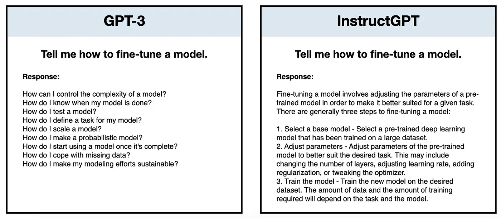

通过**有监督微调（SFT）**，我们可以让基础模型学会遵循指令。在这个微调过程中，基础模型的参数会被更新，以更好地适应我们设定的目标任务，例如更准确地理解和执行指令。

和预训练模型一样，有监督微调也使用“下一个词元预测”（next-token prediction）的方法进行训练。但不同的是，它不是单纯地预测下一个词元，而是基于用户的输入来进行预测。

### 偏好微调

最后是进一步提升模型的输出质量，使其更加符合 AI 安全要求或人类偏好的预期行为。这一步称为**偏好微调（preference tuning）**。偏好微调是一种微调方法，顾名思义，它通过我们提供的数据，将模型的输出调整得更加贴合我们的偏好。

与有监督微调类似，偏好微调也可在基座模型上进行微调，其额外优势在于：它在训练过程中引入了对输出偏好的“提炼”过程。

## 参数高效微调（PEFT）

更新模型的所有参数或可显著提升模型性能，但会有不少缺点，比如：训练成本高、训练速度慢、对存储空间需求大。为了应对这些问题，研究人员提出了参数高效微调（PEFT）的方法，这些方法可更高效地对预训练模型进行微调。

### Adapters（适配器）

**适配器**是许多 PEFT 技术的核心组成部分。这种方法的核心是在 Transformer 结构中加入一组额外的模块化组件，并只对这些组件进行微调，从而提升模型在特定任务上的表现，而无需更新模型的全部权重，这大大节省了时间和计算资源。

适配器的概念最早出现在论文[Parameter-efficient transfer learning for NLP](https://arxiv.org/abs/1902.00751)中，该研究发现：仅微调 BERT 模型 **3.6% 的参数**，就可获得与全参数微调接近的性能。在 GLUE 基准测试上，作者的结果与全参数微调的性能仅相差 **0.4%**。

在单个 Transformer 模块中，该论文提出的架构将适配器分别放置在 **注意力层** 和 **前馈神经网络层** 之后，如下图所示：

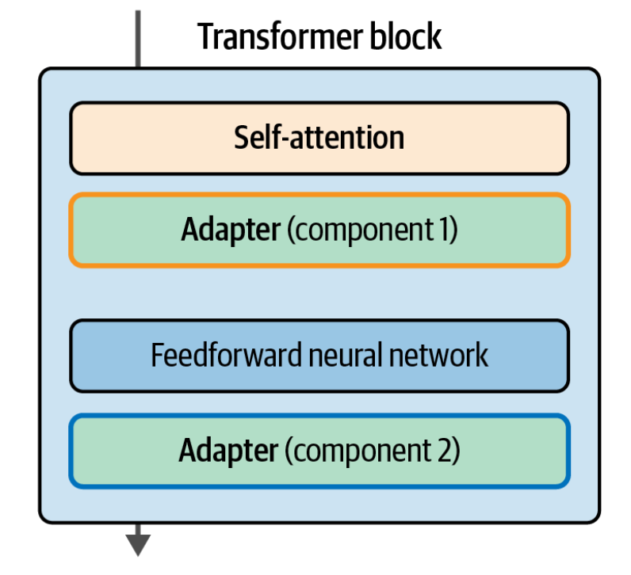

然而，仅仅修改单个 Transformer 模块还远远不够。这些适配器组件会加入到模型的**每一个Transformer模块中**，如下图 所示：

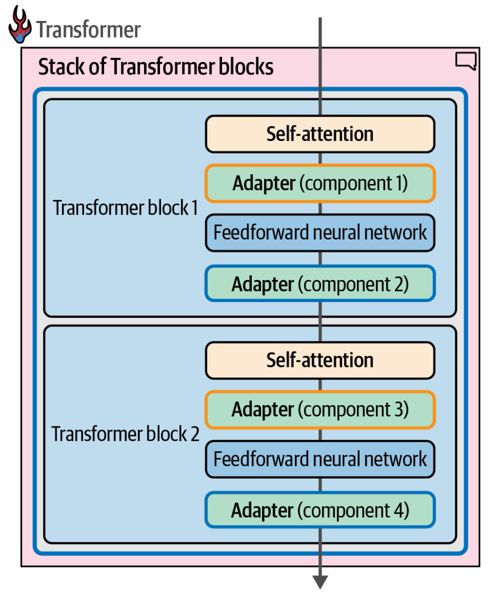

###### 

我们也可以将整个模型中所有适配器组件都可视化出来，如下图所示。我们就能把每个适配器单独看作是一个模块的集合，分别分布在模型的所有层中。比如，**适配器1** 可以专门用于医疗文本分类，而 **适配器2** 则可以专注于命名实体识别（NER）等任务。

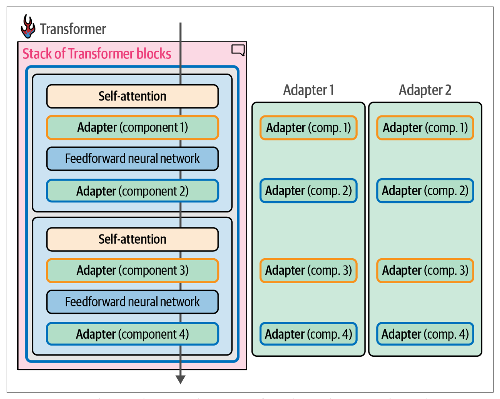

可以 [Adapter Hub](https://adapterhub.ml) 网站下载各种专门用途的适配器模块。

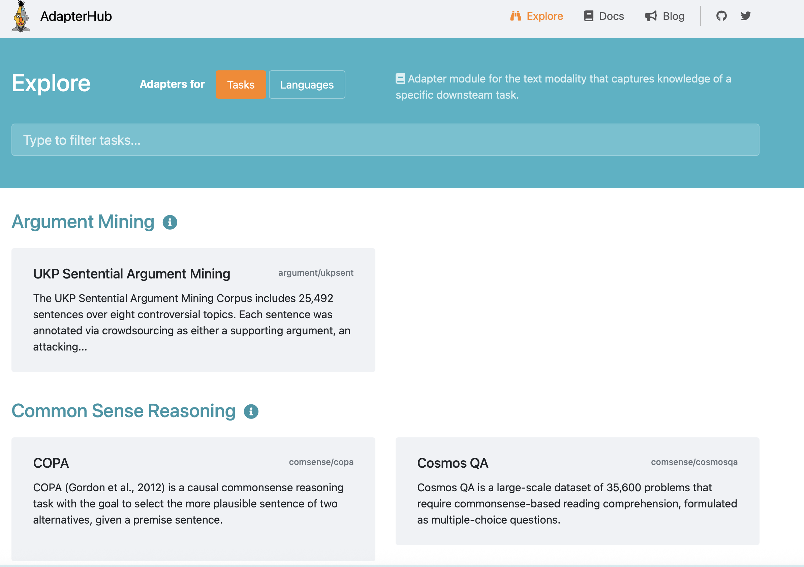

> 论文[AdapterHub: A framework for adapting transformers](https://arxiv.org/abs/2007.07779) 提出了 **AdapterHub**这一个用于共享适配器的中央仓库。早期的许多适配器主要集中在 **BERT 架构** 上。
>
> 近年来，这一概念也被应用到了文本生成类的 Transformer 模型中，例如论文[LLaMA-Adapter: Efficient fine-tuning of language models with zero-init attention](https://arxiv.org/abs/2303.16199)，展示了如何高效地对语言模型进行微调。

## 低秩适配（LoRA）

低秩适配（LoRA）是适配器的替代方案， 目前已成为参数高效微调（PEFT）中被广泛使用且效果显著的技术。与适配器方案类似，LoRA 只需更新一小部分参数。

如下图所示，LoRA 的做法不是向模型中添加新的层，而是**在基础模型中创建一个小的子集用于微调**，从而实现高效训练。

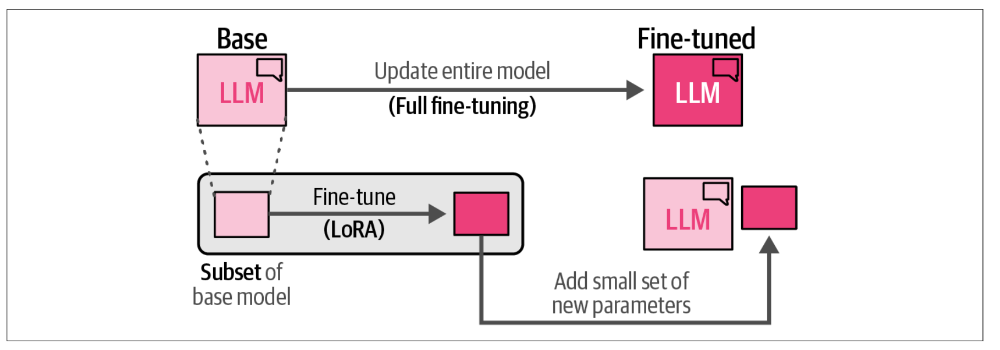

和适配器一样，LoRA 只需更新基础模型中的一小部分参数，因此可以实现更快速的微调。它的核心思想是：**用较小的矩阵来近似原始大型语言模型中的大矩阵**，从而构建出一个可用于微调的参数子集。

我们可以将这些小矩阵替代原有的大矩阵，并仅对它们进行微调。例如，假设原始模型中有一个 10 × 10 的矩阵

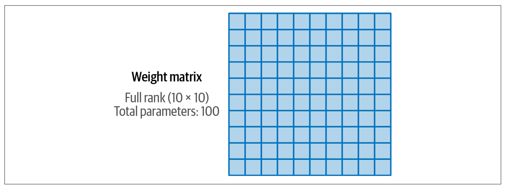

我们可以用两个较小的矩阵来近似重构这个大矩阵。这两个小矩阵相乘后可以还原成一个 10 × 10 的矩阵。

这带来了显著的效率提升——原来需要使用 **100 个参数**（10×10），现在只需 **20 个参数**（10 + 10）。

在训练过程中，我们只需更新这些较小的矩阵，而不需要对整个权重矩阵进行修改。训练后，更新后的变化矩阵（即这些小矩阵）会与原始的（**冻结的**）完整权重一起结合使用，如图 下图 所示。

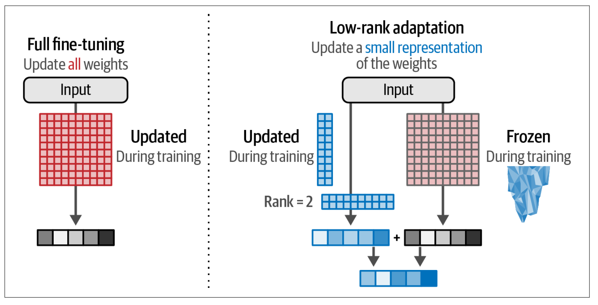

你可能会担心，这样做会导致模型性能下降，而且确实可能会这样。那么，这种**权衡**在哪些情况下是合理的呢？

[Intrinsic dimensionality explains the effectiveness of language model fine-tuning](https://arxiv.org/abs/2012.13255) 这篇论文指出，语言模型具有**非常低的内在维度（intrinsic dimensionality）**。这意味着，即使是大型语言模型中的巨大矩阵，也可以通过较小秩（rank）的方式来近似表示。

例如，拥有 1750 亿参数的模型（如 GPT-3），有96 个 Transformer 模块，每个模块都包含一个大小为 12,288 × 12,288 的权重矩阵。这意味着每个模块有多达 **1.5 亿个参数**，但如果我们能够将这个矩阵成功地降秩为 **rank 8**，只需使用两个大小为 12,288 × 2 的矩阵进行替代，这样每个模块只需**约 19.7 万个参数**。这在**速度、存储和计算资源**方面都是极大的节省，这一点在前面提到的 LoRA 论文中有详细解释。

此外，这种较小的表示方式还非常灵活：你可以选择**只微调基础模型的某些部分**。例如，我们可以只微调每个 Transformer 层中的 **Query（查询）和 Value（值）** 权重矩阵。

### 压缩模型以实现（更）高效的训练

为了使训练更高效，我们可以在将原始权重投影到较小矩阵之前，**先对模型的权重进行压缩**，从而进一步降低内存需求。这种做法可以让 LoRA 的效率更进一步提升。

大型语言模型的权重本质上是带有一定精度的数值，其精度通常以位数表示，例如 `float64`（64位浮点数）或 `float32`（32位浮点数）。如下图，**如果我们减少用于表示一个数值的位数，结果的精度会降低**，但与此同时，模型所需的内存也会显著减少。

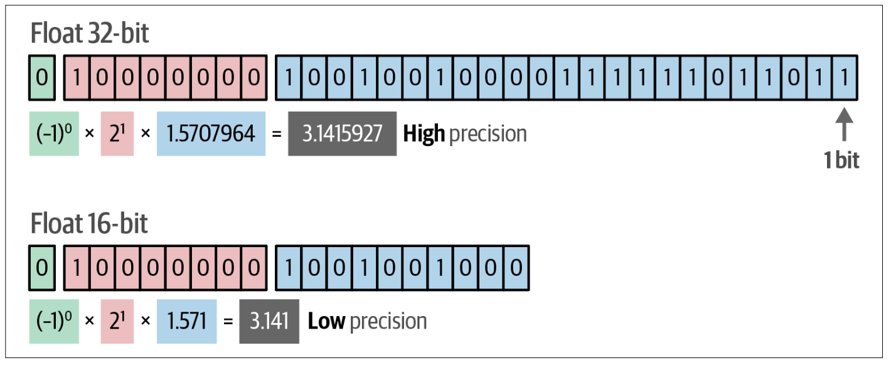

简而言之，**降低数值精度虽然会牺牲一定的准确性，但能换来更低的内存消耗**，这对于大规模模型训练来说是一种非常实用的优化策略。

量化的目标是在尽量准确地表示原始权重值的同时降低位数。然而，如下图所示，当直接将高精度值映射到低精度值时，多个高精度值可能最终会被相同的低精度值所表示。

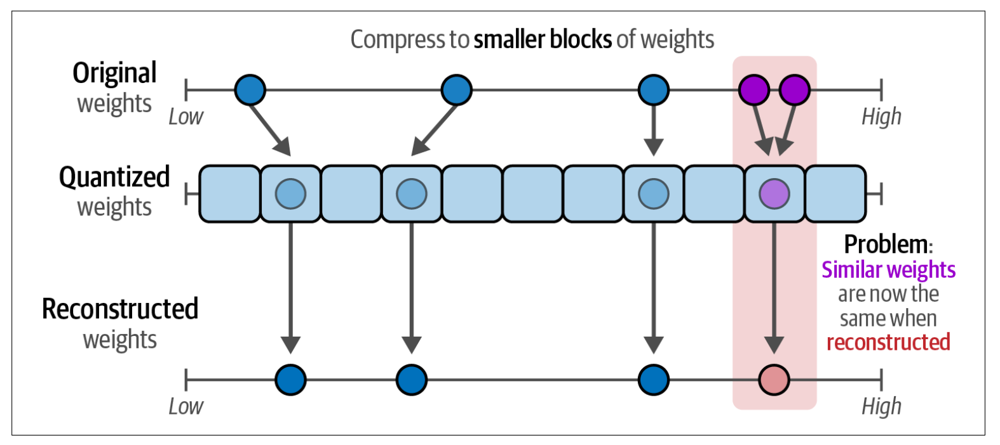

QLoRA（LoRA 的量化版本）的作者们找到了一种能够在较高位数与较低位数之间互相转换的方法，同时尽量不偏离原始权重。他们采用了块状量化，将某些高精度数值块映射到低精度数值。与直接将高精度映射到低精度不同，他们创建了额外的块，从而对相似的权重进行量化。如下图所示，这使得数值能够在低精度下被准确表示。

神经网络一个优良的特性是，它们的数值通常在 -1 到 1 之间呈正态分布。这一特性使得我们可以根据权重的相对密度，将原始权重划分到较低位数的区间中，如下图所示。这种映射方式考虑了权重的相对频率，因此更加高效，同时也减少了异常值问题。

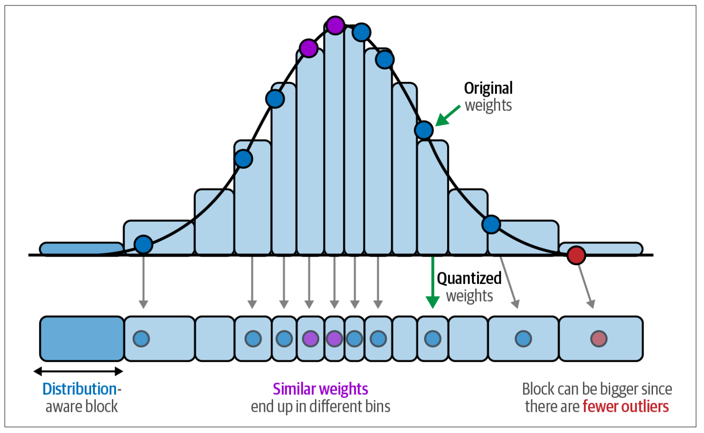

结合块状量化，归一化过程使得可以用低精度值准确地表示高精度值，同时对大语言模型（LLM）的性能影响极小。因此，我们可以将表示从 16 位浮点数转变为 4 位归一化浮点表示。4 位表示显著降低了 LLM 在训练过程中的内存需求。需要注意的是，总体上对 LLM 进行量化对于推理同样有利，因为经过量化的 LLM 尺寸更小，从而所需显存（VRAM）也更少。

> 关于量化的完整且具有高度可视化的指南，请参阅这篇博客文章：[A Visual Guide to Quantization](https://newsletter.maartengrootendorst.com/p/a-visual-guide-to-quantization)。

## 偏好调优 / 对齐 / 基于强化学习的人类反馈（RLHF）

尽管模型现在已经能够遵循指令，但我们还可以通过最后的训练阶段进一步提升其性能，使其符合我们在不同场景下的预期。例如，当被问及“什么是大语言模型（LLM）？”时，我们可能更倾向于获得一个详细描述 LLM 内部机制的答案，而不是仅仅回答“它是一个大语言模型”且没有进一步解释。那么，我们该如何将（人类）对某个答案的偏好与 LLM 的输出进行对齐呢？

我们可以请用户（偏好评估者）来评估该模型生成内容的质量。假设他们给它打了一个分数，比如 4分。模型会基于该分数所代表的偏好进行调优：

- 如果分数较高，模型会被更新，从而鼓励生成更多类似这种类型的内容。
- 如果分数较低，模型则会被更新以抑制生成此类内容。

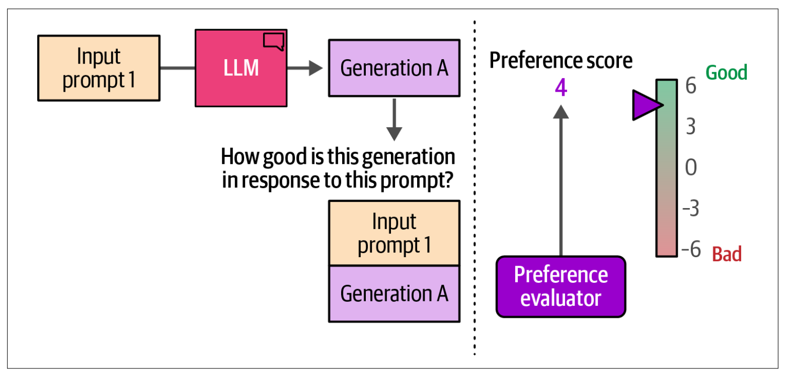

通常我们需要大量训练样本，那么我们能否自动化偏好评估呢？答案是可以的，我们可以通过训练另一种被称为奖励模型的模型来实现这一目标。

### 使用奖励模型自动化偏好评估

为了实现偏好评估的自动化，在执行偏好调优步骤之前，我们需要先训练一个奖励模型.为了创建一个奖励模型，我们复制经过指令调优的模型，并对其进行微调，使其不再生成文本，而是输出一个单一的分数。

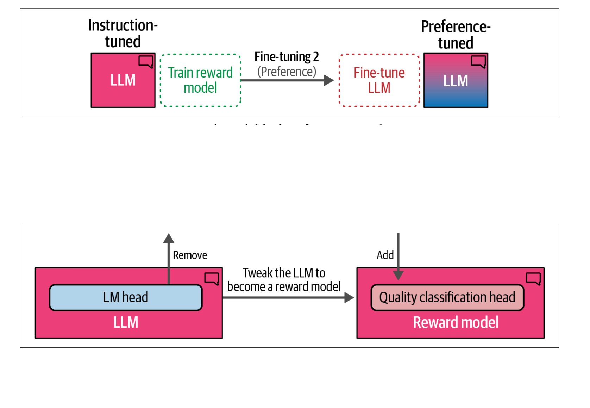

### 奖励模型的输入与输出

奖励模型期望的工作方式是：给定一个提示和生成的文本，它会输出一个单一数字，该数字表示该生成在响应该提示时的偏好/质量。

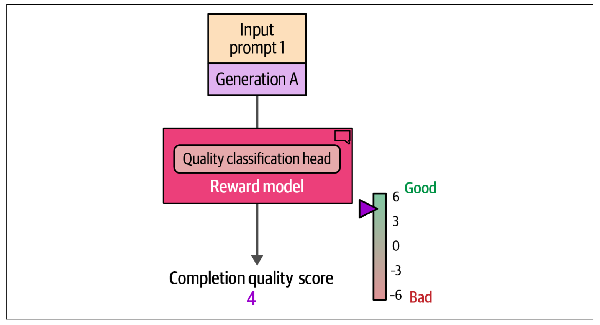

### 训练奖励模型

我们不能直接使用奖励模型，而是需要先对其进行训练，使其能够正确地为生成结果打分。因此，我们需要一个奖励模型可以学习的偏好数据集。

#### 奖励模型训练数据集

偏好数据集的一种常见形式是：每个训练样本包含一个提示，以及一个被接受的生成结果和一个被拒绝的生成结果。（注意：这并不总是意味着一个生成结果绝对好，而另一个绝对差；有时两个生成结果都不错，只是其中一个相对更优。）下图展示了包含两个训练样例的偏好训练集。

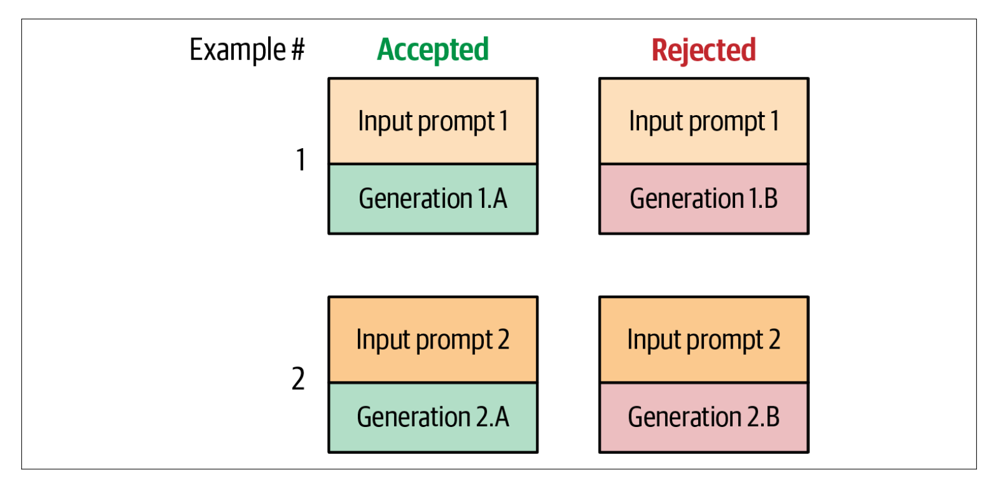

生成偏好数据的一种方法是，向大语言模型（LLM）提供一个提示，并让它生成两个不同的回答，然后我们可以请求人工标注者选择他们更倾向于哪一个回答。

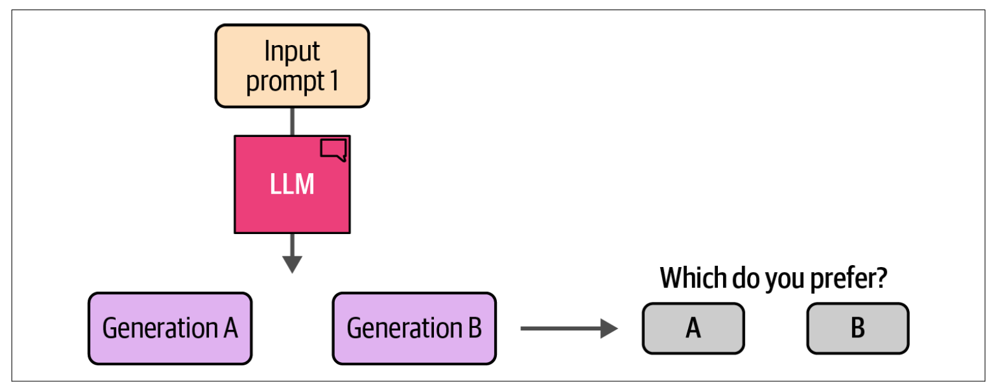

#### 奖励模型训练步骤

现在我们已经拥有了偏好训练数据集，可以开始训练奖励模型。一个简单的方法是使用奖励模型对生成结果进行评分：

1. 对被接受的生成结果打分
2. 对被拒绝的生成结果打分

训练目标是确保被接受的生成结果具有比被拒绝的生成结果更高的得分。

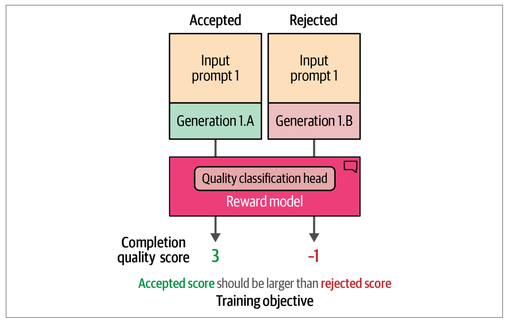

偏好调优的三个阶段：

1. 收集偏好数据
2. 训练奖励模型
3. 使用奖励模型对大语言模型进行微调（其充当偏好评估者）

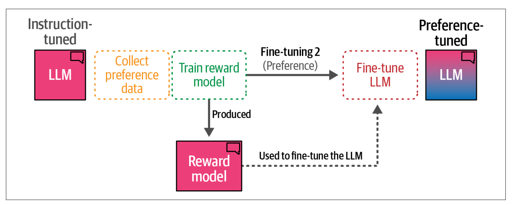

奖励模型是一个极好的想法，具有进一步扩展和发展的潜力。例如，Llama 2 训练了两个奖励模型：一个用于评估“有帮助程度”，另一个用于评估“安全性”。

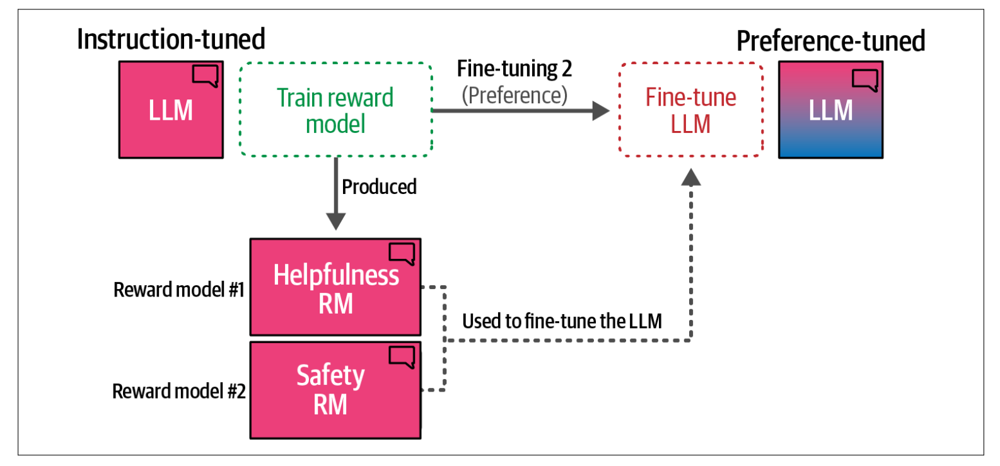

一种常用的方法是[使用近端策略优化（PPO）](https://arxiv.org/abs/1707.06347)来利用训练后的奖励模型对大语言模型进行微调。PPO 是一种流行的强化学习技术，它通过确保大语言模型的输出不会与预期奖励偏差过大，从而对经过指令调优的模型进行优化。事实上，它甚至被用于训练于2022年11月发布的原始版本 ChatGPT。

#### 训练不使用奖励模型

PPO（近端策略优化）的一个缺点是，它是一种复杂的方法，至少需要训练两个模型：奖励模型和大语言模型，这可能比实际所需成本更高。

直接偏好优化（DPO）是 PPO 的另一种替代方案，它摒弃了基于强化学习的训练过程，不再使用奖励模型来判断生成结果的质量，而是让大语言模型自身进行判断。如下图所示，我们使用一份大语言模型的拷贝作为参考模型，以比较参考模型与可训练模型在被接受生成结果和被拒绝生成结果质量之间的差距。

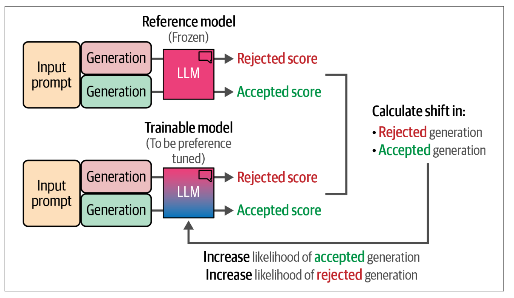

通过在训练过程中计算这种偏移，我们可以通过跟踪参考模型和可训练模型之间的差异，从而优化被接受生成结果相较于被拒绝生成结果的可能性。为计算这一偏移及其相关分数，我们分别从参考模型和可训练模型中提取被拒绝生成结果和被接受生成结果的对数概率。如下图所示，这一过程是在 token 级别上执行的，各个 token 的概率被合并起来，用于计算参考模型与可训练模型之间的偏移。

利用这些分数，我们可以优化可训练模型的参数，使其在生成被接受内容时更加自信，而在生成被拒绝内容时自信度降低。与 PPO 相比，作者们发现 DPO 在训练过程中更加稳定且更准确。鉴于其稳定性，我们将采用 DPO 作为主要模型，对之前经过指令调优的模型进行偏好调优。

